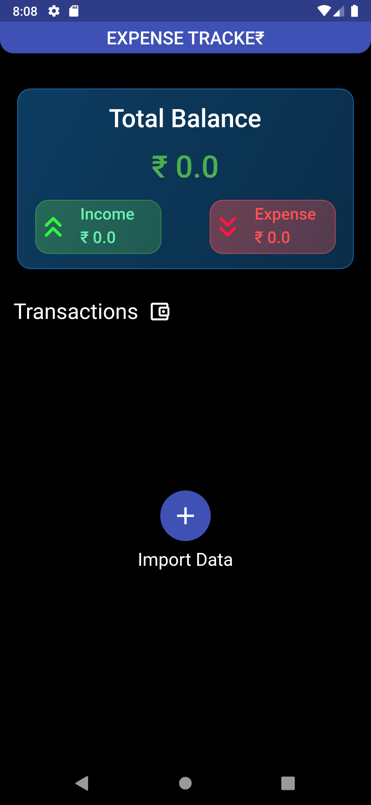
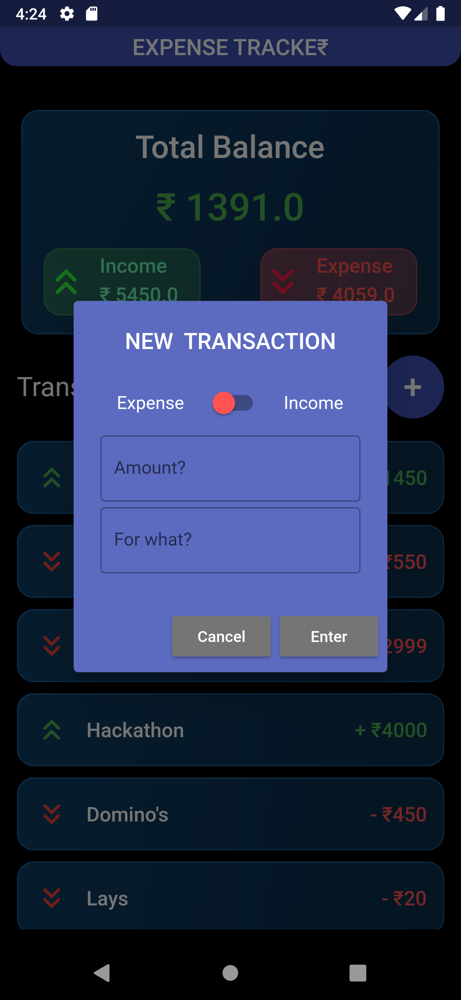
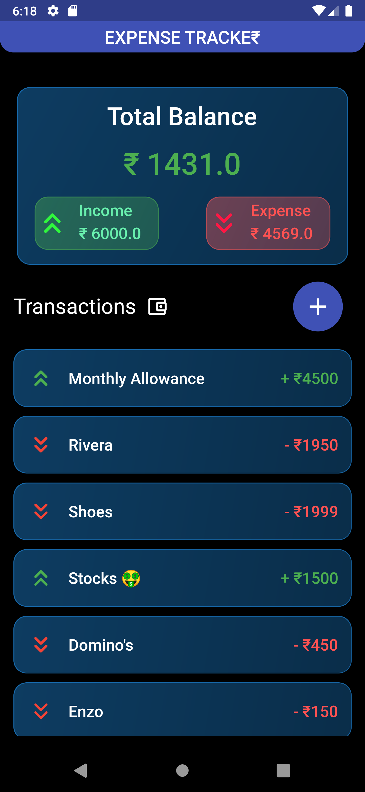
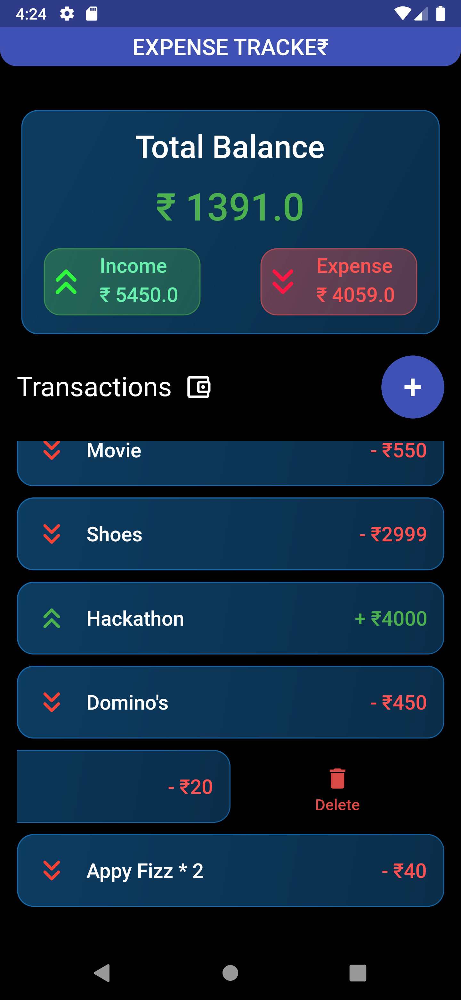
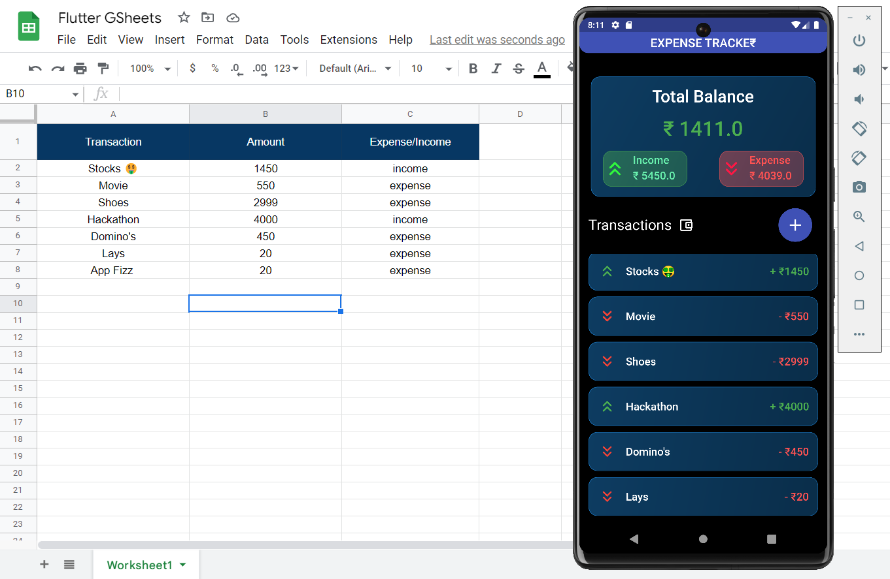

<h1 align="center">Expense Calculator</h1>

An intuitive expense calculator app designed to help you manage your finances with ease.

## Features

- Simple and user-friendly interface for quick expense tracking.
- Add expenses under different categories to maintain organized records.
- Calculate and visualize your expenses using charts and graphs.
- Set budget limits and receive notifications when approaching the limits.
- Export and share expense reports for better financial planning.

## Screen Shots

  
  
  

---------------------------------------------------------------------------------------------------------------------------------

  
  

Some of the Widgets used in this project:
- Stack
- ListView.builder()
- SingleChildScrollView
- Slidable

API's used
- Google Sheets API

UI specs
- Dark Theme 
- Uses Glass Neumorphism

A few resources to get you started if this is your first Flutter project:

- [Lab: Write your first Flutter app](https://docs.flutter.dev/get-started/codelab)
- [Cookbook: Useful Flutter samples](https://docs.flutter.dev/cookbook)

For help getting started with Flutter development, view the
[online documentation](https://docs.flutter.dev/), which offers tutorials,
samples, guidance on mobile development, and a full API reference.
